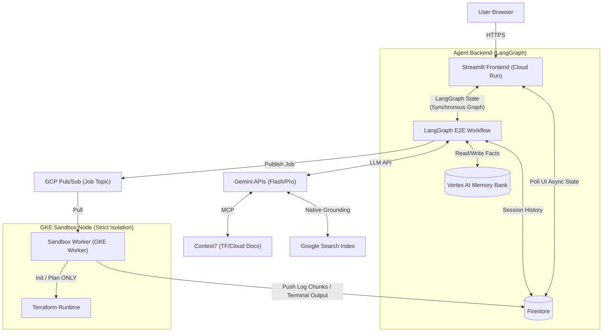
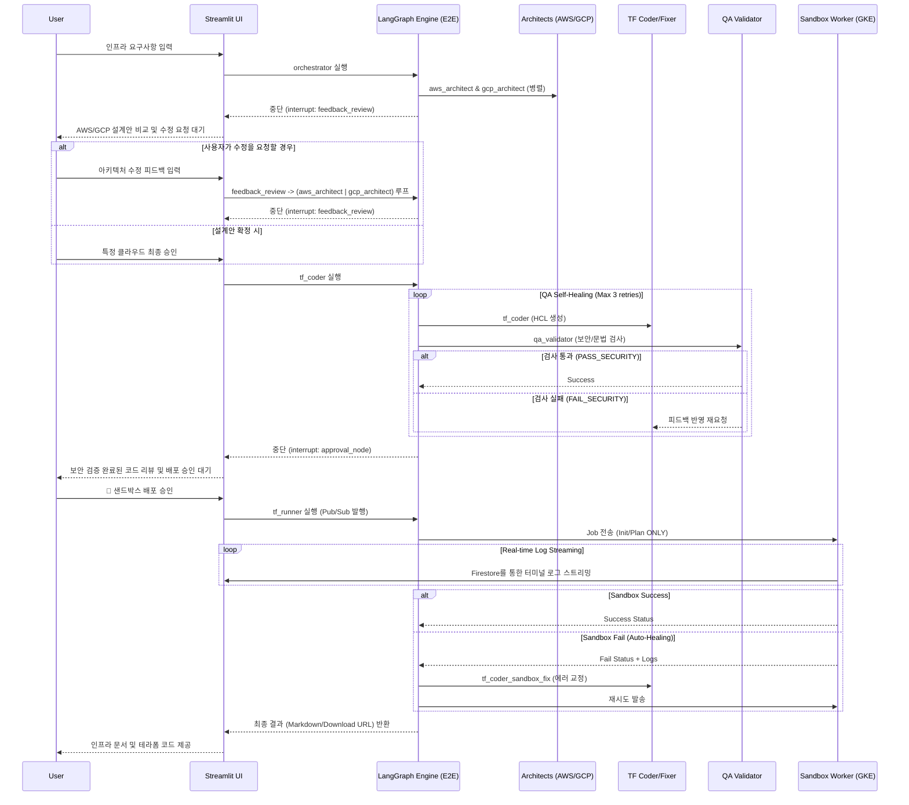

# 엔터프라이즈 클라우드 아키텍처 설계 에이전트 (Cloud BP Advisor)

## 프로젝트 개요

본 프로젝트는 LLM을 활용하여 사용자의 자연어 요구사항을 분석하고, 엔터프라이즈급 클라우드 아키텍처(AWS/GCP)를 설계, 검증 및 테라폼(Terraform) 코드를 생성하는 멀티 에이전트 시스템입니다.

**주요 업데이트**: 시스템의 운영 안정성 확보와 불필요한 과금 리스크 방지를 위해, 샌드박스 환경에서는 테라폼의 `apply` 기능을 제외한 **Plan-Only Sandbox 모드**로 동작합니다.

## 시스템 아키텍처

- **Frontend UI/UX**: `Streamlit` (Python) 기반의 반응형 채팅 인터페이스, 동적 스트리밍 렌더링 및 세션 상태 관리.
- **에이전트 프레임워크**: `LangGraph` (Python)를 활용한 5개 에이전트의 다중 협업 및 상태 관리(Checkpointing).
- **LLM 엔진**: `Gemini 3 Flash Preview` (오케스트레이션 및 일반 추론) & `Gemini 3 Pro Preview` (고난도 추론 및 코드 생성).
- **테라폼 샌드박스**: GKE 기반의 격리된 실행 환경(gVisor), `init` 및 `plan` 단계만 수행하여 코드 유효성 검증.
- **데이터 및 스트리밍**: `Firestore` (UI와 샌드박스 간의 실시간 로그 스트리밍), `Vertex AI` (장기 기억 Memory Bank).

## 시스템 아키텍처 다이어그램



## 에이전트 워크플로우 (LangGraph)



## 디렉토리 구조

프로젝트는 생산성 및 운영 표준을 준수하여 다음과 같이 구성되어 있습니다.

- `/agent-backend`: LangGraph 오케스트레이터 및 5종 에이전트 소스 (`src/` 구조)
- `/sandbox-worker`: 테라폼 검증용 샌드박스 워커 컨테이너 소스 (`src/` 구조)
- `/k8s`: GKE 배포를 위한 Kubernetes 매니페스트 파일들
- `/scripts`: 배포 및 유틸리티 스크립트 (예: `deploy.sh`, `deploy_sandbox.sh`)
- `/docs/archive`: 과거 및 참조용 문서 저장소
- `/.secrets`: 환경 변수(`.env`) 및 서비스 계정 키(`sa-key.json`) 저장 (Git 관리 제외)
- `/.agent`, `/.skills`: 에이전트 로직 및 Context7 MCP 서버 설정

*(참고: 기존의 Next.js 프론트엔드는 `agent-backend` 내의 Streamlit UI로 통합 대체되었습니다.)*

## 배포 및 인프라 구성

본 프로젝트는 GKE(Google Kubernetes Engine) 및 Google Cloud Run 환경에 배포되도록 설계되었으며, Google Cloud SDK(`gcloud`)가 필요합니다.

### 배포 절차

#### Step 0: 공통 인프라 프로비저닝 (Terraform)
애플리케이션 컨테이너를 배포하기 전, GKE 클러스터(gVisor 노드 풀 포함), Pub/Sub, GCS 버킷 등 기반 인프라를 먼저 생성해야 합니다.

1. 인프라 디렉토리로 이동합니다:
   ```bash
   cd infrastructure
   ```
2. 테라폼을 초기화하고 실행합니다 (환경 변수 적용 필수):
   ```bash
   terraform init
   terraform apply -var="project_id=$GCP_PROJECT_ID" -var="region=$GCP_REGION"
   ```
   *참고: GKE 클러스터 생성에는 약 10~15분 정도 소요됩니다.*
3. 완료 후 루트 디렉토리로 돌아옵니다: `cd ..`

#### Step 1: 애플리케이션 서비스 배포
1. **GCP 인증**: `gcloud`를 사용하여 대상 프로젝트에 인증되어 있는지 확인합니다.
2. **비밀 정보 설정**: `.secrets/` 디렉토리에 `sa-key.json`과 `.env` 파일을 배치합니다.
   
   `.secrets/.env` 파일 예시:
   ```env
   GCP_PROJECT_ID=your-gcp-project-123
   GCP_REGION=asia-northeast3
   ```
3. **배포 스크립트 실행**: 
   루트 디렉토리에서 전체 배포 스크립트를 실행합니다:
   ```bash
   ./scripts/deploy.sh
   ```
   **스크립트 동작 내용**:
   - 컨테이너 이미지를 빌드하여 Artifact Registry로 전송합니다.
   - **GKE**에 `sandbox-worker`를 배포합니다.
   - **Google Cloud Run**에 `agent-backend`를 배포합니다.

4. **배포 확인**:
   스크립트 종료 시 출력되는 Cloud Run 서비스 URL을 통해 UI에 접속합니다.

### 샌드박스 워커 단독 업데이트
`agent-backend` 수정 없이 `sandbox-worker` 코드만 수정한 경우, 더 빠른 배포를 위해 전용 스크립트를 사용하세요:
```bash
chmod +x ./scripts/deploy_sandbox.sh
./scripts/deploy_sandbox.sh
```
이 스크립트는 샌드박스 이미지 빌드, GKE 업데이트 및 워커 재기동만 빠르게 수행합니다.
