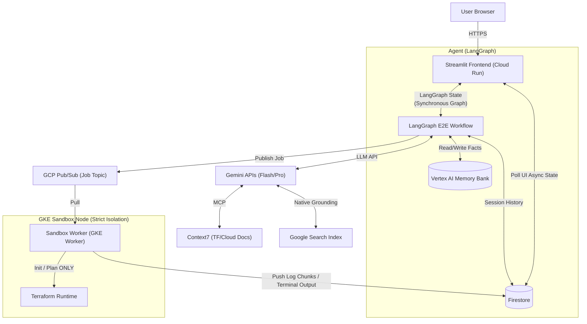
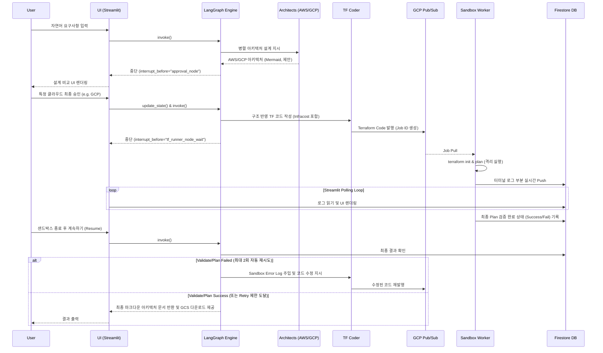

# 📄 PRD: Cloud Architecture Generation Agent 

## 1. Project Overview

본 프로젝트는 사용자의 자연어 요구사항을 분석하여 엔터프라이즈급 클라우드 아키텍처(AWS/GCP)를 설계하고, 사용자의 승인을 거친 후 **사전 검증된(Pre-tested Plan Only) Terraform 코드** 및 종합 운영/배포 가이드를 제공하는 대화형 AI 에이전트를 개발하는 것입니다. 다중 에이전트(Multi-Agent) 협업 모델을 채택하였으며, 자원 생성(과금 및 루프버그) 등 치명적 리스크를 피하기 위해 최종 배포 기능(`apply`)은 제거한 **계획 전용(Plan Only)** 샌드박스로 운영합니다.

## 2. Technology Stack

- **LLM Engine:** `Gemini 3 Flash Preview` (기본 언어 모델 및 에이전트 오케스트레이션), `Gemini 3 Pro Preview` (TF Coder 등 고난도 추론 전용 모델 믹스)
- **Frontend UI/UX:** `Streamlit (Python)` (Reactive 채팅, 동적 스트리밍 렌더링, JSON 세션 상태 관리)
- **Agent Core Framework:** `LangGraph (Python)` (5-Agent 다중 협력 오케스트레이션 및 체크포인트 영속성 관리)
- **Deep Search & Tools:** `Context7` (MCP 서버 연동), `Native Google Search Grounding` (Gemini API 내장)
- **Cost Estimation:** `Infracost` (최종 아키텍처 결정을 위한 예상 비용 산출)
- **Async Messaging:** `GCP Pub/Sub` (Terraform 샌드박스 비동기 워크로드 큐잉)
- **Data Persistence & Streaming:** 
  - `Firestore` (UI와 샌드박스 간의 실시간 로그 스트리밍, **REST API 기반 고신뢰성 연동**)
  - `Vertex AI Reasoning Engines` (Memory Bank - 장기 기억 보존용)
  - `GCS` (클라우드 저장소 및 마크다운 아키텍처 파일용 서명된 접근 URL 제공)

## 3. Architecture Diagram

## 4. Multi-Agent Architecture

단일 에이전트의 컨텍스트 오염 및 환각(Hallucination) 현상을 방지하기 위해 **5-Agent 다중 협력 아키텍처 (Supervisor & Specialist Pattern)**를 적용합니다.

### 4.1 에이전트별 역할 및 책임

1. **Orchestrator Agent:** 사용자 요구사항 분석, 도메인 전문가 호출, Memory Bank 조회/저장을 통한 장기 기억 보전, 전체 플로우의 상태(State) 관리 담당.
2. **AWS Architect Agent:** AWS 환경에 특화되어 최신 레퍼런스를 딥 서치(Context7/Grounding)하고, AWS 모범 사례 기반 구조도 및 비용 산출.
3. **GCP Architect Agent:** GCP 환경에 특화되어 최신 레퍼런스를 딥 서치하고, GCP 모범 사례 기반 구조도 및 비용 산출.
4. **Terraform Coder Agent:** 사용자가 선택한 클라우드의 아키텍처 설계를 바탕으로 `.tf` 메인 코드를 단일 파일 형태로 개발(Infracost 비용 메타데이터 포함).
5. **QA & Validator Agent (Sandbox Wrapper):** 생성된 `.tf` 코드를 격리된 샌드박스로 비동기 전송합니다. `terraform init` 및 `terraform plan` 로그를 수집하여 HCL 문법 및 프로비저닝 가능성을 자가 점검(Self-Healing)하고, 실패 시 Coder에게 에러 로그와 함께 재작성을 지시합니다. (최대 재시도 횟수 소진 대책 포함).

### 4.2 시스템 시퀀스 다이어그램 (Workflow)

## 5. Security & Stability Controls (핵심 제약 사항)

### 5.1 Sandbox Plan-Only Policy
과거 `apply` 및 `destroy`를 포함한 파이프라인은 과금 위험 및 리소스 정리 실패(Zombie Resources)의 크리티컬 에러를 노출했습니다. 운영 레벨 전환에 따라 샌드박스는 HCL 코드 실행 전 단계인 **`init` 과 `plan`만을 격리 수행**하도록 강제합니다. 실제 리소스 배포는 제외하며, 생성된 인프라 코드는 검증 후 다운로드 형태로 고객에게 전달됩니다.

### 5.3 Sandbox Connectivity & REST Reliability
GKE Sandbox(gVisor) 환경에서의 gRPC(HTTP/2) 불안정성 문제를 해결하기 위해, 워커의 모든 외부 통신(Pub/Sub, Firestore)은 **HTTP/1.1 REST API**를 사용합니다. 이는 보안 격리 수준을 유지하면서도 네트워크 순단이나 스트림 끊김 현상 없는 100%의 통신 신뢰도를 보장합니다.

### 5.4 Hybrid Deployment Strategy
시스템 부하가 가변적인 **Streamlit Backend**는 **Cloud Run**에 배포하여 서버레스 오토스케일링을 구현하고, 강력한 격리가 필요한 **Terraform Sandbox**는 **GKE gVisor Node Pool**에서 운영하는 하이브리드 전략을 취합니다.
