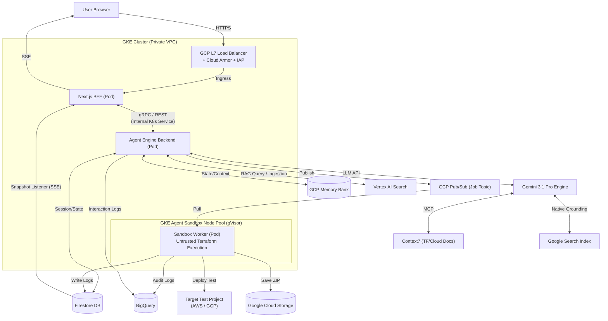
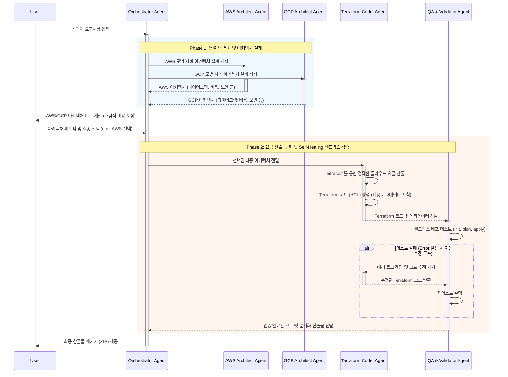

# 📄 PRD: Enterprise Cloud Architecture Generation Agent

## 1. Project Overview

본 프로젝트는 사용자의 자연어 요구사항을 분석하여 엔터프라이즈급 클라우드 아키텍처(AWS/GCP)를 설계하고, 사용자의 승인을 거친 후 **사전 검증된(Pre-tested) Terraform 코드** 및 종합 운영/배포 가이드를 제공하는 대화형 AI 에이전트를 개발하는 것입니다.

## 2. Technology Stack (Mandatory)

- **LLM Engine:** `Gemini 3.1 Pro` (복잡한 아키텍처 추론 및 Deep Search 용도)
- **Frontend UI/UX:** `Next.js (App Router)`, `Tailwind CSS`, `Zustand`
- **Network & Security:** `GCP L7 Load Balancer`, `Cloud Armor`, `IAP`
- **Agent Core Framework:** `LangGraph (Python)` (5-Agent 다중 협력 오케스트레이션)
- **Deep Search & Tools:** `Context7` (MCP), `Native Google Search Grounding` (Gemini 내장)
- **Cost Estimation:** `Infracost` (최종 아키텍처 선택 시점 계산)
- **Async Messaging & Events:** `GCP Pub/Sub` (Terraform 샌드박스 비동기 큐잉), `Eventarc`
- **Real-time Streaming:** `Firestore` 또는 `Server-Sent Events (SSE)` (터미널 로그 실시간 전송)
- **Data Persistence:** `Firestore` 또는 `Cloud SQL` (상태 및 세션 DB), `GCP Memory Bank`, `GCS`, `BigQuery`, `Vertex AI Search Datastore`
- **Compute & Orchestration (GKE 통합 아키텍처):**
- 전체 애플리케이션(BFF, Agent Backend, Sandbox Worker)은 단일 **`Google Kubernetes Engine (GKE) Private Cluster`** 내에 마이크로서비스(Pod) 형태로 통합 배포됩니다.
- 특히 Terraform 코드가 실행되는 샌드박스 워커는 악의적인 코드 실행을 원천 차단하기 위해 **`GKE Agent Sandbox (gVisor 기반)`**가 적용된 별도의 격리된 Node Pool에서 실행되어야 합니다.
- Agent Engine은 GKE 내부망을 통해 구동되며, 외부의 GCP 관리형 서비스(Firestore, Memory Bank 등)와 안전하게 통신합니다.

---

## 3. Architecture Diagram

에이전트가 코드를 바로 짜지 않고, 외부 검색 도구(Deep Search)를 활용해 아키텍처를 먼저 설계하는 흐름을 반영한 구조도입니다.

---

## 4. Multi-Agent Architecture Pattern (다중 에이전트 아키텍처 패턴)

단일 에이전트의 컨텍스트 오염 및 환각(Hallucination) 현상을 방지하기 위해 **5-Agent 다중 협력 아키텍처 (Supervisor & Specialist Pattern)**를 적용합니다.

### 4.1 에이전트별 역할 및 책임

1. **Orchestrator Agent (통합 리드 에이전트):** 사용자와의 대화 인터페이스를 담당하며, 요구사항 구체화, 에이전트 호출 조율, 최종 산출물 취합을 수행합니다.
2. **AWS Architect Agent (도메인 전문가):** AWS 환경에 특화되어 최신 레퍼런스를 딥 서치하고, AWS 모범 사례 아키텍처 다이어그램 및 비용 산출을 전담합니다.
3. **GCP Architect Agent (도메인 전문가):** GCP 환경에 특화되어 최신 레퍼런스를 딥 서치하고, GCP 모범 사례 아키텍처 다이어그램 및 비용 산출을 전담합니다.
4. **Terraform Coder Agent (구현 전문가):** 설계된 아키텍처를 바탕으로 최신 Provider 문법에 맞춰 `.tf` 코드를 순수하게 생성하는 데만 집중합니다.
5. **QA & Validator Agent (검증 및 테스터):** 샌드박스에서 코드를 실행하고 에러를 분석하여, Terraform Coder에게 자율적인 피드백(Self-Healing)을 제공하는 깐깐한 리뷰어 역할을 수행합니다.

### 4.2 다중 에이전트 시퀀스 다이어그램 (Workflow Graph)

---

## 5. Core Workflow & User Journey (핵심 6단계 흐름)

클라이언트와 에이전트 간의 상호작용은 반드시 다음 6단계의 논리적 흐름을 따라야 합니다.

### Step 1: Deep Search 기반 모범 사례 아키텍처 설계

- 사용자의 요구사항이 입수되면, 에이전트는 즉시 코드를 생성하지 않습니다.
- **Gemini 3.1 Pro** 모델을 코어 엔진으로 사용하여, `Context7` 도구와 내장된 **Native Google Search Grounding** 기능을 통해 최신 AWS 및 GCP 공식 문서와 레퍼런스를 **Deep Search(심층 검색)** 합니다.
- 검색된 최신 정보를 바탕으로 요구사항에 최적화된 **AWS 및 GCP 양측의 모범 사례 아키텍처**를 각각 설계합니다.

### Step 2: 아키텍처 제안 및 비교 (Well-Architected 관점)

- 설계가 완료되면 Orchestrator UI를 통해 사용자에게 두 가지(AWS, GCP) 아키텍처 옵션을 나란히 제시합니다.
- 이때 각 아키텍처는 다음 요소를 반드시 포함하여 설명되어야 합니다:
- **아키텍처 다이어그램** (React Flow 또는 시각화 라이브러리 연동)
- **비용 (Cost)** (예상 월별 청구액)
- **보안 (Security)** (접근 제어, 암호화 등)
- **성능 (Performance)** (확장성, 병목 지점)
- **안정성 (Reliability)** (HA, DR 구성 등)

### Step 3: 사용자 검토 및 Iteration (피드백 루프)

- 사용자는 제시된 양측의 아키텍처를 검토합니다.
- 사용자가 아키텍처에 대한 추가 요구사항(예: "AWS 설계에서 DB를 Aurora Serverless로 변경해줘", "GCP 예산이 너무 높아, 아키텍처를 경량화해봐")을 입력하면, 에이전트는 **Step 2와 Step 3을 반복**하여 아키텍처를 수정하고 재제시합니다.

### Step 4: 최종 아키텍처 선택

- 사용자가 UI 상에서 최종적으로 구현할 아키텍처(AWS 또는 GCP 중 택 1)를 선택(Accept)합니다.

### Step 5: 정확한 요금 산출, Terraform 코드 개발 및 샌드박스 검증 (비동기 처리)

- 최종 선택이 완료된 시점에서야 에이전트(Terraform Coder)는 선택된 아키텍처 JSON을 바탕으로 **`Infracost` 도구를 호출하여 정확한 월별 예상 요금을 산출**합니다.
- 이후 요금 메타데이터를 포함한 **Terraform(HCL) 코드 개발**을 시작합니다.
- 생성된 코드는 GCP Pub/Sub을 통해 샌드박스 환경(격리된 컨테이너)으로 비동기 전달됩니다.
- 샌드박스 워커(QA Validator)는 `terraform init -> plan -> apply (실제 배포) -> destroy` 과정을 거치며 정상 동작 여부를 **반드시 사전에 테스트하고 확인**합니다. (에러 시 자동 수정 루프 포함).
- 이 과정의 터미널 로그는 Firestore Snapshot Listener 또는 SSE(Server-Sent Events)를 통해 사용자 화면에 안정적이고 실시간으로 스트리밍됩니다.

### Step 6: 최종 산출물 패키징 및 제공

- 샌드박스 테스트가 성공적으로 완료되면, 에이전트는 산출물에 구조화된 메타데이터(아키텍처 목적, 클라우드, 비용 태그 등)를 자동 주입한 후 다음 산출물을 GCS에 저장하고 사용자에게 제공(ZIP 다운로드)합니다.
- 동시에 이 산출물 및 메타데이터는 데이터 파이프라인(Eventarc 또는 Agent API 직접 호출)을 통해 청킹(Chunking)되어 향후 RAG 소스로 활용될 수 있도록 **Vertex AI Search Datastore에 자동 인덱싱(Ingestion)** 됩니다.

1. **정상 동작 Terraform Code** (사전 검증 완료 및 Meta-Tag 주입)
2. **인프라 배포 Step-by-step 가이드**
3. **트러블슈팅 및 운영 매뉴얼**
4. **배포 후 정상 동작 확인용 테스트 시나리오**
5. **전체 아키텍처 상세 설명서**
6. **사용자 팀 교육용 가이드 자료** (Markdown 형식)

---

## 6. Non-Functional & Enterprise Requirements

- **Security & RAG:** 모든 대화 로그(BigQuery)와 최종 산출물(GCS)은 암호화되어 저장되며, 향후 `Vertex AI Search`를 통해 모범 사례 인덱싱 및 재활용을 위한 RAG 소스로 사용됩니다.
- **Sandbox Isolation:** Terraform 실행 컨테이너는 내부망에 격리되며, 과금 폭탄 방지를 위해 엄격한 리소스 생성 제한 및 타임아웃 룰을 적용합니다.
